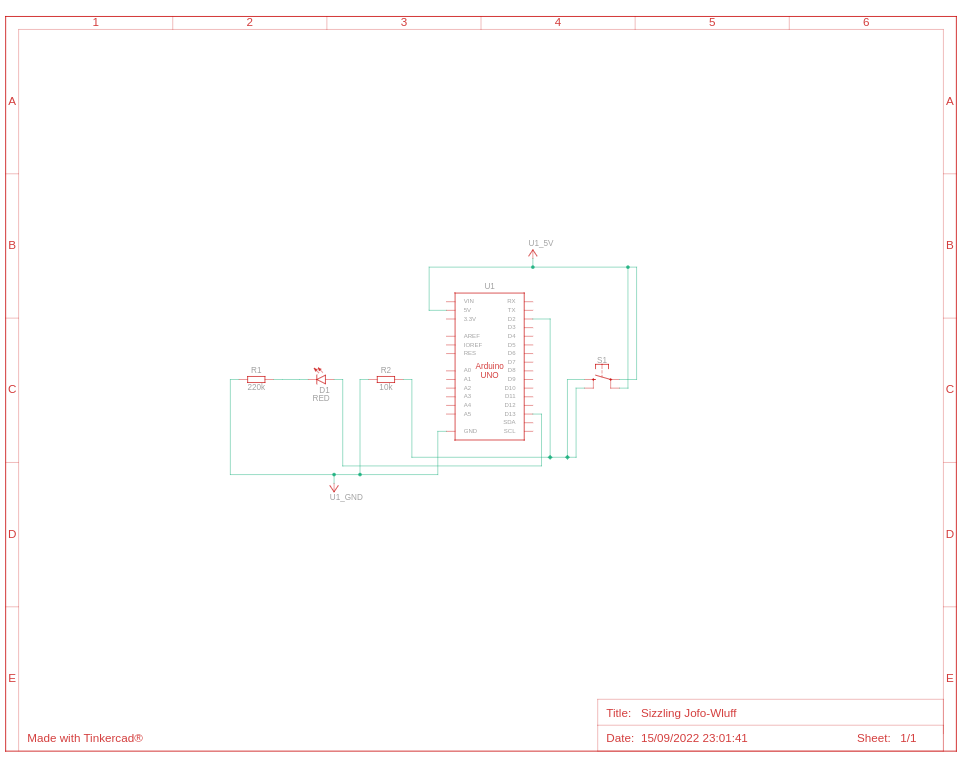
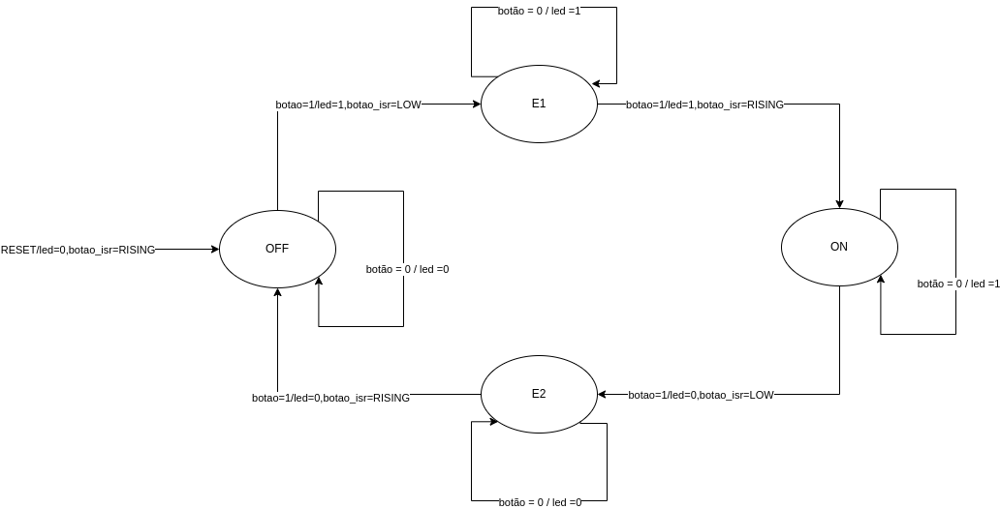

<h1 align="center">Resolução programa 1</h1>

Interruptor LED

## Solução

A solução foi encontrada por meio de chamadas de interrupções para os botões não terem conflitos entre os mesmos, juntamente com um encadeamento de eventos por meio de estados.
## Esquema elétrico

## Máquina de estado

## Código

Executar o arquivo [Código do Interruptor LED](interruptor-led.ino) na [IDE](https://docs.arduino.cc/software/ide-v1/tutorials/Linux) do arduino e seguir o esquema elétrico para execução do programa 1.

