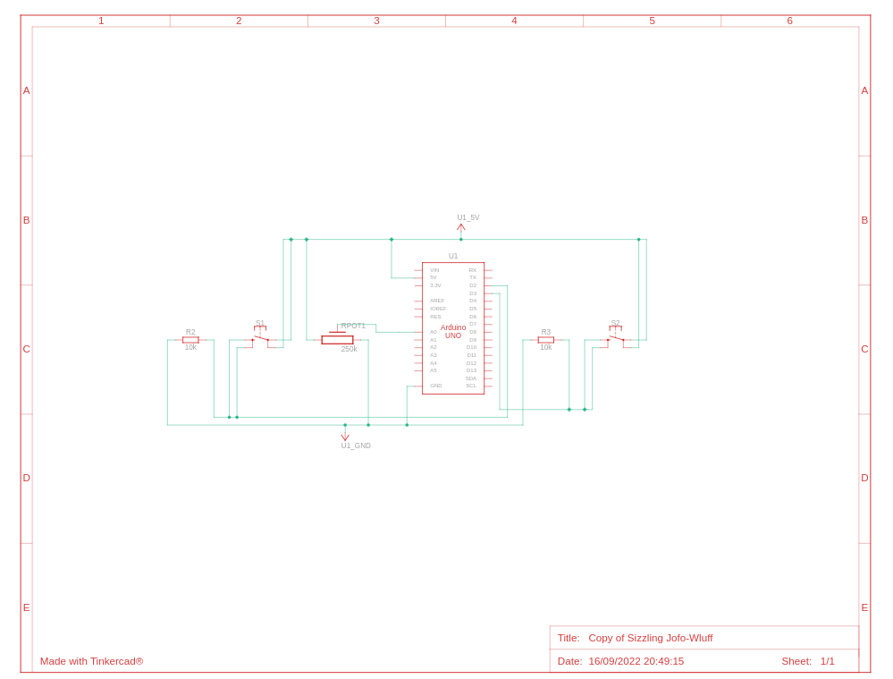
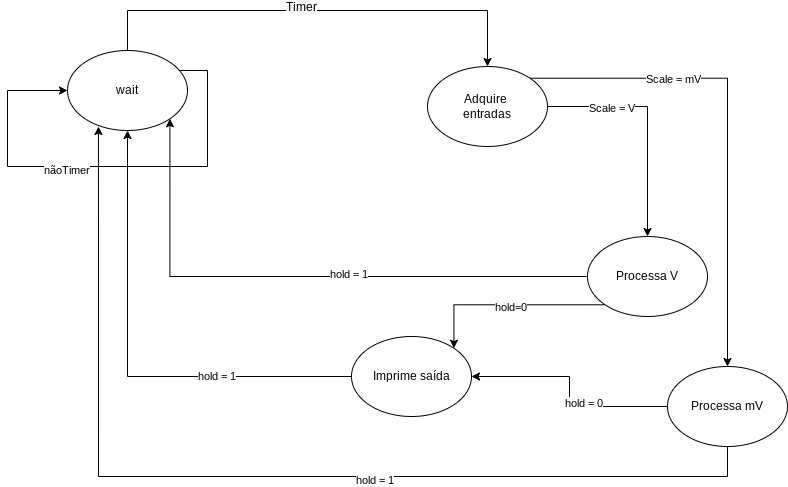

<h1 align="center">Resolução programa 2</h1>

Voltímetro Digital

## Solução

A solução foi encontrada por meio da resolução do diagrama de máquina de estados onde o mesmo deve apenas fazer o que estado realiza e repassar informação para o estado seguinte.

## Esquema elétrico

## Máquina de estado

## Código

Executar o arquivo [Código do Voltímetro Digital](voltimetro-digital.ino) na [IDE](https://docs.arduino.cc/software/ide-v1/tutorials/Linux) do arduino e seguir o esquema elétrico para execução do programa 2.

## Problemas

Não foi possível identificar o motivo de não manter o estado de V e MV.